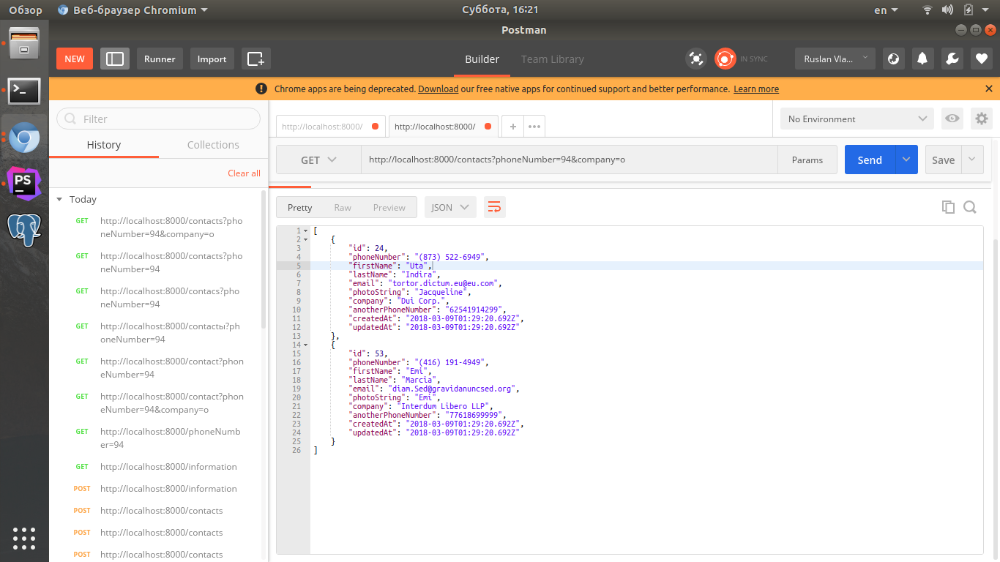

# This repo houses code for search the contacts  (using Sequelize and PostgreSQL)"

If you dont have install  node-js, please go this link [https://nodejs.org](https://nodejs.org)

# Sequelize Setup

Let's begin by installing Sequelize CLI package. ```npm install -g sequelize-cli```

# PostgreSQL Setup for LINUX 

### You need to add the latest PostgreSQL repository for the latest version.
  
```sudo add-apt-repository "deb https://apt.postgresql.org/pub/repos/apt/ trusty-pgdg main"```

### Update and Install PostgreSQL 9.6:
    
```$xslt
sudo apt-get update
sudo apt-get install postgresql-9.6

```

### Default postgres super user and postgres database is created. You need to set a password for the postgres super user.

```
    ubuntu@:~$ sudo passwd postgres
   Enter new UNIX password:****
   Retype new UNIX password:****
   passwd: password updated successfully
   
   ```
   
   ### If service is not started, you can start the PostgreSQL service.
       
``` sudo service postgresql start ```

### Connect PostgreSQL server using postgres user:
    
``` 
ubuntu@:~$ su postgres
Password:****
 ```
        
 ### Create a sample database:
  
  ```createdb database_name```
  
  ### Connect to that database:
      
``` psql -d database_name ```


# Config Setup

#### go to directory /you_project/server/config and open file config.json and change settings under your database

```$xslt
{
  "development": {
    "username": "you_DATABASE_username",
    "password": "you_DATABASE_password",
    "database": "you_DATABASE_name",
    "host": "127.0.0.1",
    "port": 5432,
    "dialect": "postgres"
  },
}
```


# Project Setup

1. Use command  ```npm install``` for install dependices
2. Now try running the application by executing ```npm run start:dev```
and visiting [http://localhost:8000](http://localhost:8000). 
You should see {"message":"Welcome to the beginning of nothingness."}
3. Running the migrations to do this, we run the following command:  ```sequelize db:migrate```
4. You can seed your database with this data by running this sequelize-cli command: ```sequelize db:seed:all```

#### under run project need use [postmean](https://www.getpostman.com/apps) or another application


###### for get contacts all names the saved under one phone number, use example query [127.0.0.1:8000/contact?phoneNumber=94](127.0.0.1:8000/contact?phoneNumber=94)


###### for save array contacts use post query which is listed below
.


###### transfer request, name or last name or companyName and get the most matching phone numbers. Example query [http://localhost:8000/contacts?phoneNumber=94&companyName=o](http://localhost:8000/contacts?phoneNumber=94&companyName=o)
.


###### Get a list of phone numbers with information (name, surname, companyName), by key. Example query [http://localhost:8000/contacts](http://localhost:8000/contacts)
.


Have fun! smile